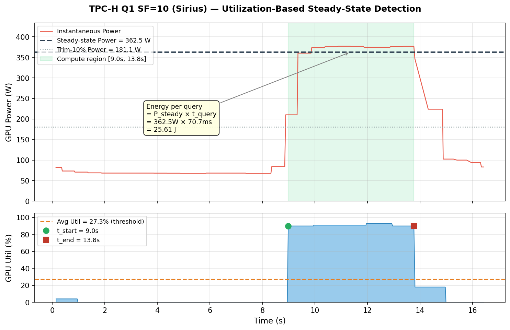

# Maximus: GPU-Accelerated SQL Benchmark Suite

Comparing **Maximus** (standalone GPU query engine, Acero + cuDF) and **Sirius** (DuckDB GPU extension) across TPC-H, H2O, and ClickBench.

## Quick Start

```bash
git clone --recurse-submodules https://github.com/Weiwei1001/gpu_db.git
cd gpu_db
./setup.sh            # one-click: deps + build + data
source setup_env.sh

# Run benchmarks
python benchmarks/scripts/run_all.py                    # both engines
python benchmarks/scripts/run_all.py --engine maximus   # Maximus only
python benchmarks/scripts/run_all.py --engine sirius    # Sirius only
```

## Measurement Methodology

### 1. Timing

Both engines measure **pure GPU compute time** — data is pre-loaded to VRAM before timing starts.

**Maximus** uses the `maxbench` C++ binary. Each query is bracketed by CUDA stream barriers (`context->barrier()`) and timed with `std::chrono::high_resolution_clock`:

```
barrier()  →  start_time  →  execute()  →  barrier()  →  end_time
```

The pre/post barriers ensure all GPU kernels have completed, so the wall-clock interval captures true GPU execution time (not just kernel launch latency). Data is loaded once with `-s gpu` (GPU storage mode) and stays in VRAM across all repetitions — the timings exclude any PCIe transfer.

**Sirius** uses DuckDB's built-in `.timer on`, which prints `Run Time (s): real X.XXX` after each query. GPU buffers are pre-allocated via `gpu_buffer_init("20 GB", "10 GB")` before the timed region.

**Repetitions and reporting:**

| | Maximus | Sirius |
|---|---|---|
| Reps per query | 50 (default) | 3 passes, 100 reps each |
| Reported metric | **min** across reps | **last pass** timing |
| Batch size | All queries in one process | 10 queries per batch |
| Why | Min filters out OS/scheduling noise | 3rd pass avoids cold-start; batching avoids GPU memory leaks |

```bash
# Timing benchmark
python benchmarks/scripts/run_maximus_benchmark.py tpch h2o clickbench
python benchmarks/scripts/run_sirius_benchmark.py tpch h2o

# Direct maxbench usage
./build/benchmarks/maxbench --benchmark tpch -q q1,q2,q3 -d gpu -r 50 \
    --path tests/tpch/csv-1 -s gpu --engines maximus
```

### 2. Energy & Power

GPU power is sampled via `nvidia-smi` at **50ms intervals** from a background thread during query execution:

```
Step 1: Calibrate — run 3 reps to measure base latency (e.g. 15ms/query)
Step 2: Calculate n_reps so total runtime >= 10s (e.g. ceil(10000/15) = 667 reps)
Step 3: Run n_reps while sampling nvidia-smi every 50ms
Step 4: Detect steady-state compute region via GPU utilization
Step 5: Compute avg power within compute region → derive energy
```

#### Steady-state detection (utilization-based)

A typical power trace has three phases: idle (~70W, GPU loading data), compute (200-400W, queries executing), and cooldown. Simply trimming 10% from each end fails when the idle phase is long — it still includes mostly idle samples.

Instead, we use **GPU utilization as the boundary signal**:

```
1. Compute avg_util across ALL samples
2. t_start = first sample where gpu_util >= avg_util
3. t_end   = last  sample where gpu_util >= avg_util
4. P_steady = mean(power[t_start : t_end])    ← compute-region average
```

This isolates the actual compute phase regardless of how long the idle/loading phase lasts.

#### Energy per query

```
E_query = P_steady × t_query
```

where `P_steady` is the utilization-bounded average power, and `t_query` is the per-query latency from timing measurements (not the total multi-rep runtime).

#### Example: TPC-H Q1, SF=10 (Sirius)



- **455 samples** over 16.3s. Avg GPU utilization across all samples = 27.3%
- **Utilization threshold** detects compute region at [9.0s, 13.8s] (green shading)
- **P_steady = 362.5W** (avg within compute region), vs naive trim-10% = 181.1W (includes idle)
- **Energy per query** = 362.5W x 70.7ms = 25.6 J
- Bottom panel shows GPU util: the green/red dots mark t_start and t_end where util crosses the threshold

```bash
# Run energy/power measurement
python benchmarks/scripts/run_maximus_metrics.py tpch --scale-factors 1 2 10

# Output: *_metrics_summary.csv (per-query avg power, energy, GPU util)
#         *_metrics_samples.csv (raw 50ms samples: time, power, util, mem)
```

### 3. Collected Metrics

Each nvidia-smi sample captures:

| Metric | Unit | Source |
|--------|------|--------|
| `power_w` | Watts | `power.draw` |
| `gpu_util_pct` | % | `utilization.gpu` |
| `mem_used_mb` | MB | `memory.used` |
| `pcie_tx/rx_mbs` | MB/s | `pcie.link.gen.current` |

Summary CSV columns per query: `avg_power_w`, `max_power_w`, `max_mem_mb`, `avg_gpu_util`, `energy_j`, `elapsed_s`, `n_reps`.

## Benchmark Results

### TPC-H (ms per query, GPU storage)

| Query | Sirius SF1 | Maximus SF1 | Sirius SF2 | Maximus SF2 | Sirius SF10 | Maximus SF10 |
|-------|-----------|------------|-----------|------------|------------|-------------|
| q1 | 17.69 | 18 | 19.15 | 36 | 70.65 | 148 |
| q2 | 36.41 | 5 | 31.56 | 7 | 35.73 | 26 |
| q3 | 9.67 | 13 | 10.88 | 25 | 22.81 | 100 |
| q4 | 9.44 | 9 | 7.79 | 16 | 22.35 | 65 |
| q5 | 17.99 | 15 | 16.10 | 40 | 27.27 | 194 |
| q6 | 6.78 | 10 | 5.41 | 19 | 15.48 | — |
| q7 | 23.05 | 16 | 20.74 | 29 | 33.60 | — |
| q8 | 24.27 | 17 | 23.07 | 48 | 39.57 | — |
| q9 | 35.90 | 21 | 20.66 | 60 | 42.96 | — |
| q10 | 22.35 | 14 | 17.95 | 28 | 37.29 | — |

### H2O Groupby (ms, Sirius)

| Query | 1gb | 2gb | 3gb | 4gb |
|-------|-----|-----|-----|-----|
| q1 | 129 | 892 | 1,035 | 409 |
| q2 | 764 | 323 | 1,228 | 520 |
| q3 | 414 | 713 | 2,616 | 1,171 |
| q5 | 171 | 239 | 332 | 526 |
| q7 | 343 | 540 | 1,706 | 969 |

### Completion Status

| Benchmark | SF | Sirius | Maximus |
|-----------|-----|--------|---------|
| TPC-H | 1 | 25/25 OK | 22/22 OK |
| TPC-H | 2 | 25/25 OK | 22/22 OK |
| TPC-H | 10 | 25/25 OK | 20/22 (q21-22 OOM) |
| H2O | 1-4gb | 40/40 (3 fallback) | 36/36 OK |
| ClickBench | 1-2 | — | 78/78 OK |
| ClickBench | 10-100 | 168/172 (12 fallback) | — |

## Project Structure

```
gpu_db/
├── setup.sh                        # One-click deployment
├── sirius/                         # DuckDB GPU extension (git submodule)
├── src/maximus/                    # Maximus engine source
├── benchmarks/
│   ├── maxbench.cpp                # C++ benchmark binary
│   ├── scripts/
│   │   ├── run_all.py              # Master runner (both engines)
│   │   ├── run_maximus_benchmark.py
│   │   ├── run_maximus_metrics.py  # Power/energy measurement
│   │   ├── run_sirius_benchmark.py
│   │   ├── compare_results.py
│   │   └── plot_metrics.py         # Visualization
│   └── data/                       # Data generation scripts
├── results/                        # CSVs + plots
├── scripts/                        # Build & install scripts
├── docs/                           # Detailed guides
└── third_party/                    # cxxopts, sqlparser
```

## License

Apache License 2.0
